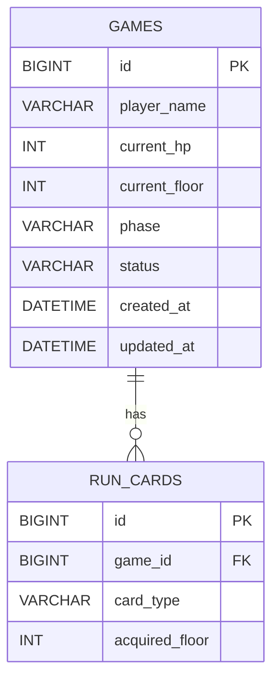

# 붉은 달의 성채

게임의 진행 상태를 저장/조회하고, 외부 랭킹 소스를 검증해 순위를 매기는 Spring Boot 기반 REST API 과제입니다.

## API 명세

### 공통 에러 응답 형식

```json
{
  "status": 404,
  "error": "Not Found",
  "message": "게임을 찾을 수 없습니다. id=1",
  "path": "/games/1"
}
```

`GlobalExceptionHandler`가 아래 예외를 공통 포맷으로 변환합니다.

| 예외 | 상태코드 | 메시지 |
|---|---|---|
| `GameNotFoundException` | 404 | `게임을 찾을 수 없습니다. id={gameId}` |
| `GameFinishedException` | 409 | `이미 끝난 여정은 진행을 저장할 수 없습니다. id={gameId}` |
| `MethodArgumentNotValidException` (요청 바디 검증 실패) | 400 | `{필드명} 값이 올바르지 않습니다: {검증 메시지}` |
| `ConstraintViolationException` (파라미터 검증 실패) | 400 | 첫 번째 위반 메시지 |
| `HttpMessageNotReadableException` / `MethodArgumentTypeMismatchException` | 400 | `요청 본문이나 파라미터 형식이 올바르지 않습니다.` |

> `/rankings`의 404는 `ResponseStatusException`으로 던져지며 `GlobalExceptionHandler`를 거치지 않아 위 `ErrorResponse` 포맷이 아닌 Spring 기본 오류 바디로 내려갑니다.

### 게임 (`/games`)

| Method | Path | 설명 | Request | Response | 에러 케이스 |
|---|---|---|---|---|---|
| GET | `/games` | 게임 목록 조회 (id 내림차순), N+1 없이 카드 수 집계 | 없음 | `200` `List<GameSummaryResponse>` | 없음 (빈 목록이면 `[]`) |
| GET | `/games/{gameId}` | 게임 상세 조회 (덱 포함) | 없음 | `200` `GameDetailResponse` | `404` 게임 없음 |
| POST | `/games` | 새 게임 생성 (초기값: `currentHp=99`, `currentFloor=1`, `phase=REWARD`, `status=PLAYING`) | `CreateRequest` | `201` `GameDetailResponse` | `400` 검증 실패 |
| PUT | `/games/{gameId}/progress` | 진행 상태 + 덱 전체 저장 (덱 전체 삭제 후 재삽입) | `ProgressRequest` | `200` `GameDetailResponse` | `404` 게임 없음, `409` 이미 종료된 게임(`status != PLAYING`), `400` 검증 실패 |
| PATCH | `/games/{gameId}` | 플레이어 이름 변경 | `RenameRequest` | `204` No Content | `404` 게임 없음, `400` 검증 실패 |
| DELETE | `/games/{gameId}` | 게임 삭제 (연관 카드 함께 삭제) | 없음 | `204` No Content | `404` 게임 없음 |

#### Request DTO

**CreateRequest**

```json
{
  "playerName": "string (2~12자, 필수)",
  "deck": [ { "cardType": "string (필수)", "acquiredFloor": "int (0~10, 필수)" } ]
}
```

**ProgressRequest**

```json
{
  "currentHp": "int (0~99, 필수)",
  "currentFloor": "int (1~10, 필수)",
  "phase": "BATTLE | REWARD | FINISHED",
  "status": "PLAYING | CLEARED | FAILED",
  "deck": [ { "cardType": "string (필수)", "acquiredFloor": "int (0~10, 필수)" } ]
}
```

**RenameRequest**

```json
{ "playerName": "string (2~12자, 필수)" }
```

#### Response DTO

**GameSummaryResponse** (목록용)

```json
{
  "id": "Long",
  "playerName": "String",
  "currentFloor": "Integer",
  "currentHp": "Integer",
  "phase": "GamePhase",
  "status": "GameStatus",
  "deckSize": "Integer",
  "createdAt": "LocalDateTime",
  "updatedAt": "LocalDateTime"
}
```

**GameDetailResponse** (상세/생성/진행저장 응답)

```json
{
  "id": "Long",
  "playerName": "String",
  "currentHp": "int",
  "currentFloor": "int",
  "phase": "GamePhase",
  "status": "GameStatus",
  "deck": [ { "id": "Long", "cardType": "String", "acquiredFloor": "Integer" } ],
  "createdAt": "LocalDateTime",
  "updatedAt": "LocalDateTime"
}
```

### 랭킹 (`/rankings`)

| Method | Path | 설명 | Request | Response | 에러 케이스 |
|---|---|---|---|---|---|
| GET | `/rankings` | 외부 랭킹 소스를 조회해 클리어(10층, `CLEARED`)한 정상 기록만 필터링/검증 후 정렬해 반환 | 없음 | `200` `RankingResponse` | `404` 소스가 없거나 유효한 기록이 0건 |

정렬 기준: `durationSeconds` 오름차순 → `finalHp` 내림차순 → `record.id` 오름차순. 동일 플레이어는 최상위 1건만 채택.

유효 기록 판정 로직:

- 대상: `run.status == "CLEARED"` && `run.clearedFloor == 10`
- 정상 런: `durationSeconds >= clearedFloor * 30`, `0 < finalHp < 100`
- 정상 덱: 크기 9~20, 각 카드의 `cardType`이 `CardType` enum 값, `acquiredFloor`는 0~9
- 정상 보스전: `phases`가 정확히 3개(순서 `THRONE, UNBOUND, ECLIPSE`), 각 phase `turns >= 1`, `totalTurns`가 phase turns 합과 일치, `finishingCard`가 덱에 포함된 카드 타입

**RankingResponse**

```json
{
  "season": "String",
  "totalRecords": "Integer (필터 전 전체 개수)",
  "excludedCount": "Integer (검증 탈락 건수)",
  "entries": [
    {
      "rank": "Integer",
      "playerName": "String",
      "clearTimeSeconds": "Integer",
      "remainingHp": "Integer",
      "bossTurns": "Integer",
      "deckSize": "Integer"
    }
  ]
}
```

---

## ERD

### games

| 컬럼 | 타입 | 제약조건 |
|---|---|---|
| id | BIGINT | PK, AUTO_INCREMENT |
| player_name | VARCHAR(12) | NOT NULL |
| current_hp | INT | NOT NULL |
| current_floor | INT | NOT NULL |
| phase | VARCHAR(16) | NOT NULL (BATTLE, REWARD, FINISHED) |
| status | VARCHAR(16) | NOT NULL (PLAYING, CLEARED, FAILED) |
| created_at | DATETIME | NOT NULL, 수정 불가 |
| updated_at | DATETIME | 자동 갱신 |

### run_cards

| 컬럼 | 타입 | 제약조건 |
|---|---|---|
| id | BIGINT | PK, AUTO_INCREMENT |
| game_id | BIGINT | FK → games.id, NOT NULL |
| card_type | VARCHAR | NOT NULL (`CardType` enum 값) |
| acquired_floor | INT | NOT NULL |

`Game` 1 : N `RunCard` 단방향 관계로, `RunCard`가 `game_id`를 FK로 참조합니다(`@ManyToOne(LAZY)`). `Game`에는 역방향 컬렉션 매핑이 없어 조회 시 별도 쿼리로 카드를 가져오며, 게임 삭제 시 서비스 로직에서 연관 카드를 먼저 삭제합니다.

> 랭킹 관련 클래스는 외부 API 응답을 매핑하는 DTO이며 DB 테이블로 존재하지 않습니다.


